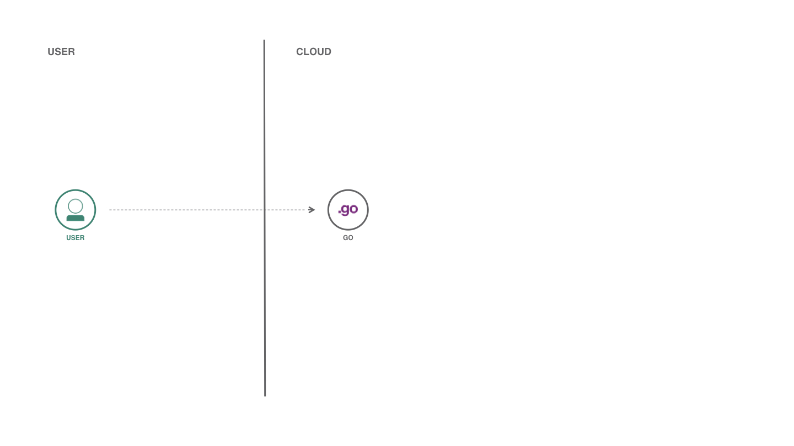

# Go Cloud

[](https://cloud.ibm.com)
[](https://developer.ibm.com/?s=golang/)
[](https://goreportcard.com/report/github.com/victorshinya/go-cloud)

A Golang boilerplate code to test and benchmark cloud platforms.



## Run locally

First things first, you need to install [Golang](https://golang.org) and quick set up the local environment (your computer), before you run app locally.

### Using Golang CLI

```sh
go run main.go
```

### Using Docker (with `docker-compose`)

```sh
cd deployments
docker-compose up
```

## Deploy the application

You can deploy on IBM Cloud in two different ways: using Go buildpack (using the Golang Runtime) or using Static buildpack (which uses [NGINX](https://www.nginx.com)). By default, the IBM Cloud will use Staticfile for cloud environment. If you want to deploy using Golang, use the flag `-b go_buildpack`.

### Go Runtime

```sh
ibmcloud cf push -f deployments/manifest.yml
```

- `-b` for the Golang Buildpack;
- `-f` for the `manifest.yml` file path (app environment configuration).

### Staticfile or NGINX

```sh
ibmcloud cf push
```

Or you can use the 1-click deploy button. It will use the platform's DevOps pipeline to build and deploy the app.

Support platforms:

- [IBM Cloud](https://cloud.ibm.com/devops/setup/deploy?repository=https://github.com/victorshinya/go-cloud)
- [Heroku](https://heroku.com/deploy?template=https://github.com/victorshinya/go-cloud/tree/master)

## License

MIT License

Copyright (c) 2020 Victor Shinya
